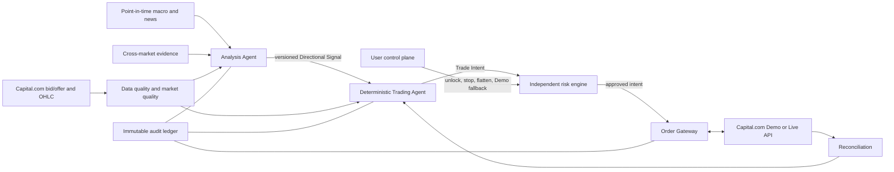
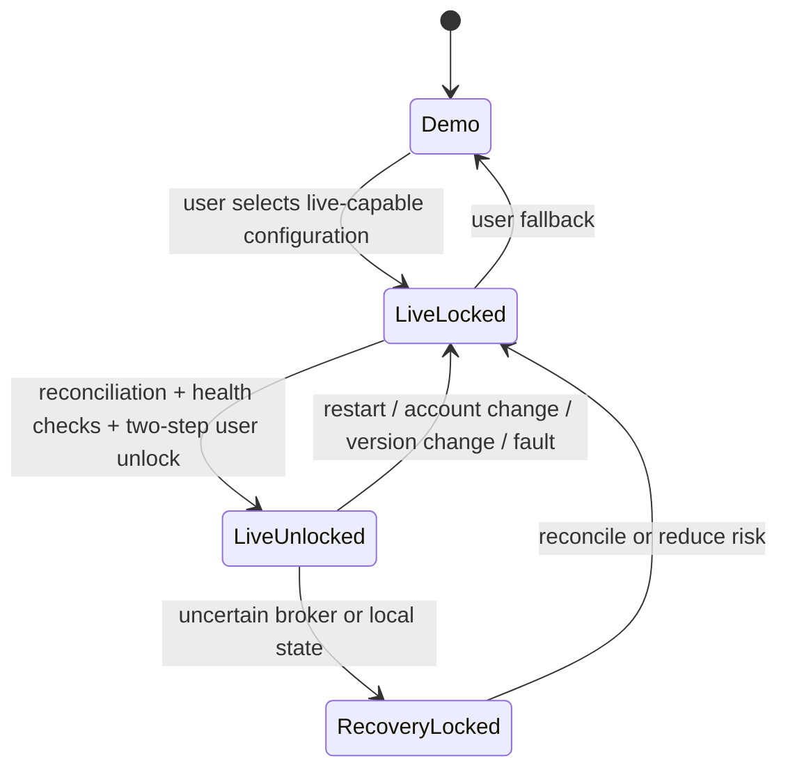

# Autonomous Gold CFD Trading System Specification

Status: `approved-for-demo-development`

Decision date: 2026-09-06

Implementation authorization: User requested construction based on this specification on 2026-09-06. Offline and Demo development may proceed. Live and unresolved account-specific capabilities remain gated as described below.

Primary API research: [Capital.com Gold Spot CFD 自動交易介面研究](../../docs/research/capital-com-gold-spot-api.md)

## 1. Objective

Build a user-owned, two-agent system for Capital.com Gold Spot CFD. The Analysis Agent produces evidence-backed market direction; the deterministic Trading Agent manages entries, sizing, stops, profit-taking, and exits through an isolated Order Gateway.

The economic target is for realized trading profit to cover AI, data, hosting, spread, and slippage costs. This is a measurement objective, not a promise of profit. If evidence does not show positive expectancy, the system remains in Demo Mode or stops.

## 2. Scope

### In scope

- Capital.com Gold Spot CFD only.
- Long, short, and `NO_TRADE` decisions.
- `LEFT_REVERSAL` and `RIGHT_CONTINUATION` strategy modes.
- One-hour market foundation, five-minute confirmation, and one-minute execution.
- Point-in-time macroeconomic, news, and cross-market context.
- Backtest, market replay, Demo execution, shadow execution, and gated Live execution.
- A local Windows development environment and a later always-on cloud deployment.
- Full decision, order, fill, failure, and cost auditability.

### Out of scope for the first release

- Any instrument other than Capital.com Gold Spot CFD.
- Overnight, weekend, or holiday-gap exposure.
- High-frequency or millisecond news trading.
- Multiple simultaneous strategy positions or long/short hedging.
- Loss averaging.
- An AI model generating broker payloads or holding credentials.
- Automatic promotion from Demo Mode or Live Locked to Live Unlocked.
- Capital.com's official MCP as an unattended execution path; its documented flow requires per-trade user confirmation.
- Guaranteed profitability or guaranteed cost recovery.

## 3. System boundaries



### 3.1 Responsibilities

| Component | May do | Must not do |
|---|---|---|
| Analysis Agent | Evaluate evidence; select strategy mode and direction; explain confidence and invalidation | Hold credentials; submit orders; reuse stale evidence |
| Trading Agent | Confirm setup; calculate deterministic position actions; manage one net position | Change the Risk Envelope; improvise broker parameters with an LLM |
| Risk engine | Enforce size, stop, margin, session, circuit breaker, and mode constraints | Be bypassed by confidence or user-interface code |
| Order Gateway | Authenticate, submit, modify, cancel, query, and reconcile | Accept unapproved or non-idempotent intents |
| Control plane | Lock Live, flatten, cancel, select Demo, request Live unlock | Cancel mandatory stops or silently reset a hard lock |

## 4. Directional Signal contract

Each signal must be structured, immutable, and auditable. At minimum it contains:

- `signal_id` and strategy version
- `created_at_utc`, source observation times, and `expires_at_utc`
- `direction`: `LONG`, `SHORT`, or `NO_TRADE`
- `strategy_mode`: `LEFT_REVERSAL` or `RIGHT_CONTINUATION`
- one-hour basis and supply/demand zone identifiers
- five-minute confirmation condition
- one-minute execution constraints
- price invalidation point
- deterministic rule score, calibrated model confidence, and explanation
- evidence references and data-completeness result
- market-quality snapshot

Duplicate, expired, superseded, incomplete, or invalidated signals cannot create Trade Intents.

The account-specific Capital.com `epic` is discovered with `GET /markets?searchTerm=Gold`, verified with `GET /markets/{epic}`, and then placed on an environment/account allowlist. The ticker or example value `GOLD` is never assumed to be authoritative without this check.

## 5. Analysis policy

### 5.1 Timeframe hierarchy

1. **One hour:** trend, regime, major supply/demand zones, and macro context.
2. **Five minutes:** setup confirmation, structural reversal, breakout/continuation, and trailing structure.
3. **One minute:** precise trigger, order timing, partial-exit execution, and fill-aware management.
4. **Streaming quote:** bid/offer, spread, freshness, tradability, and execution feasibility.

One-minute conditions normally cannot oppose the one-hour basis. A `LEFT_REVERSAL` exception requires price to enter a pre-identified one-hour zone and a completed five-minute structural reversal.

### 5.2 Strategy separation

- `LEFT_REVERSAL`: counter-move entry at a deterministic one-hour zone after five-minute reversal confirmation.
- `RIGHT_CONTINUATION`: entry aligned with a confirmed one-hour trend after a five-minute breakout, retest, or continuation confirmation.
- A signal selects exactly one mode. Conditions from both modes cannot be mixed to manufacture a trade.
- Long and short performance is measured separately for each mode and market regime.

### 5.3 Macro and news

- Deterministic surprise and regime scores are calculated before AI synthesis.
- The AI model may directly select `LONG`, `SHORT`, or `NO_TRADE`, but the Trading Agent still requires a completed five-minute price confirmation and acceptable Market Quality.
- The system does not trade the first seconds after a scheduled release.
- For scheduled quantitative releases, source, release time, receive time, and actual value are mandatory. A missing mandatory field produces `NO_TRADE`.
- Optional evidence uses a versioned weighted-completeness model. Weighted missingness of 40% or more produces `NO_TRADE`.
- Qualitative-news eligibility remains a research gate until an equivalent evidence schema is approved.
- CFTC COT, gold ETF flow, and central-bank purchase data provide slow-moving context only and never trigger a one-minute order.

### 5.4 Cross-market context

The first research set includes the US dollar, US nominal and real rates, material Treasury yields, and silver. These can alter direction confidence or cause `NO_TRADE`; Gold Spot price confirmation remains mandatory.

### 5.5 Indicator policy

Reproducible price structure and supply/demand zones are primary. ATR, directional efficiency, moving-average slope, or other indicators may quantify volatility, trend, and risk but cannot independently trigger a trade. Capital.com `lastTradedVolume` is auxiliary broker-specific evidence unless its semantics and stability are proven.

## 6. Market Quality and timing

New positions require all of the following:

- Capital.com reports the instrument as tradeable in a normal market mode.
- The time lies within an approved high-liquidity London/New York window adjusted for daylight saving time.
- Quotes are fresh, ordered, continuous, and internally valid.
- Spread is at or below a versioned dynamic threshold based on the prior 20 valid trading days for the same time window.
- Volatility is neither uneconomically low nor operationally extreme.
- Expected reward after spread and modeled slippage is at least 1.5 times initial risk.

Low-volatility default: using the last 12 completed five-minute bars, if the one-hour high-low range is less than USD 5, return `NO_TRADE`. This can be overridden only when deterministic one-hour structure and five-minute directional-efficiency conditions both qualify. Numeric trend thresholds are calibrated through backtesting and frozen by strategy version.

Extreme high volatility is never overridden by trend confidence.

Missing bars, duplicate timestamps, crossed bid/offer, invalid OHLC, or clock drift invalidate new decisions. Decision data is never interpolated; it is backfilled and recomputed before trading resumes.

## 7. Risk Envelope

| Control | Agreed value |
|---|---:|
| Demo risk at Broker Hard Stop per initial trade | 0.25% of account equity |
| Initial Live risk at Broker Hard Stop per initial trade | 0.10% of account equity |
| Normal aggregate margin usage ceiling | 20% of account equity |
| Absolute aggregate margin usage ceiling | 70% of account equity |
| Soft Circuit Breaker | 3% Realized Daily Loss |
| Hard Circuit Breaker | 10% Realized Daily Loss |
| Minimum expected reward/risk after costs | 1.5 |
| Concurrent exposure | One Gold Spot net position |
| Averaging down | Prohibited |
| Pyramiding | At most one add-on to a profitable position |
| Daily trade-count cap | None; quality and loss gates still apply |

### 7.1 Required behavior

- Position size is derived from the structural stop distance and the risk limit, never the reverse.
- If Capital.com's minimum size breaches the risk limit, the trade is skipped.
- A Broker Hard Stop is attached when the position is opened. It may only stay unchanged or tighten.
- The first release cannot autonomously exceed the 20% normal margin ceiling. The 70% ceiling detects and contains exceptional account conditions; it is not a position target.
- A profitable position may be increased once only after the original exposure has moved to break-even or locked profit, five-minute structure reconfirms, and total remaining loss at all hard stops does not exceed the original risk amount.
- At +1R, close 50% of the position. Move the remaining hard stop to at least net break-even after spread and modeled slippage, then trail the remaining 50% using completed five-minute structure; one-minute noise alone does not move the stop.
- A reverse signal closes the existing net position before a new opposite Trade Intent can be evaluated. Hedging is prohibited.

### 7.2 Circuit-breaker policy

- Both daily circuit breakers use realized P&L, per the user decision. Unrealized loss alone does not trigger an account circuit breaker.
- At -3% realized daily P&L, block new positions for the rest of the trading day. Existing exposure continues deterministic risk management.
- At -10% realized daily P&L, cancel working orders, reduce/close exposure, and enter a hard lock requiring human recovery.
- Because unrealized P&L is excluded, Broker Hard Stops and broker reconciliation are safety-critical. Backtests and reports still measure intraday floating drawdown.
- Gaps, slippage, market closure, and broker failure can exceed the planned stop loss; no guarantee is implied.

## 8. Session and position lifecycle

- Stop opening new positions 30 minutes before the instrument's current daily overnight-funding boundary.
- Cancel working entry orders and close all exposure 10 minutes before that boundary.
- Do not carry positions through weekends or special-market holidays; weekly and holiday closures use additional researched buffers.
- Broker-reported schedules and market status take precedence over hard-coded clock assumptions.



## 9. Order workflow

1. Trading Agent creates an idempotent Trade Intent.
2. The risk engine performs an in-memory preview and validates the full Risk Envelope.
3. The Order Gateway submits the authorized request.
4. The system obtains broker confirmation and reconciles position, stop, fill, and account state.

Entry orders prefer expiring limit or stop orders. Marketable entry is permitted only when modeled slippage is within the versioned threshold. Exits prioritize reducing risk.

Capital.com's Public API documents `LIMIT` and `STOP` working orders, while another first-party page describes Public API orders as market orders. The Demo adapter must resolve this conflict empirically before entry-order behavior is considered complete.

An HTTP 200 or returned `dealReference` is not proof of execution. The gateway must poll `GET /confirms/{dealReference}` and reconcile broker state. An API timeout is an unknown outcome, not a failed order. After two seconds without a definitive result, query confirmations, broker positions, working orders, and activity; do not blindly resubmit. Any unresolved mismatch enters Recovery Locked and sends an alert.

The public REST reference does not document size-based partial close or a complete partial-fill model. The +1R 50% exit remains a required Demo experiment and a hard blocker for declaring the Trading Agent complete.

Performance targets:

- In-process decision and risk validation: under 100 ms.
- Trigger to first broker response: p95 under 1 second, measured rather than guaranteed.
- System clock offset: attempt correction above 500 ms; prohibit new positions above 1 second.

## 10. Data and auditability

Capital.com venue-native bid/offer history and streaming quotes are the primary execution record. Third-party prices may enrich research but cannot independently unlock Live.

Every decision cycle records:

- immutable input references or content hashes
- source observation, publication, receive, and decision timestamps in UTC
- data status, missingness, and freshness
- rule scores, AI model and prompt versions, signal and intent IDs
- Market Quality and risk evaluations, including rejected trades
- broker requests with secrets removed, responses, confirmations, fills, partial fills, and reconciliation
- realized and unrealized P&L, spread, modeled/actual slippage, and exit reason
- AI token, data, and hosting cost attribution

Credentials, session tokens, API keys, passwords, and unmasked personal identifiers are prohibited from the audit record.

## 11. Technology and security constraints

- Python 3.12 asynchronous core.
- The trading service is independent of the UI and continues managing risk when the UI closes.
- Local development: SQLite in WAL mode behind a storage interface.
- Cloud Live target: PostgreSQL using the same migrations and domain records.
- Local secrets: Windows Credential Manager. Cloud secrets: a later-selected managed secret store.
- The Analysis Agent and Trading Agent cannot read broker credentials; only the Order Gateway can.
- Capital.com currently documents only trade-capable API keys, not read-only keys. Market-data access therefore stays behind the same credential-isolated gateway.
- The system restarts in Live Locked. Live unlock requires account/instrument confirmation and a one-time explicit phrase from the user.
- Any account switch, material fault, or strategy/model version change revokes Live Unlocked.
- The AI model, prompt, deterministic rules, and parameters are version-frozen in Live. New versions run in shadow mode until revalidated and user-approved.

## 12. Failure behavior

- Analysis, AI, news, or optional cross-market outage: no new positions; deterministic management of existing exposure continues.
- Broker disconnect: no new positions; reconnect and reconcile against broker authority.
- Missing or invalid data: no new positions; backfill and recompute without decision-time interpolation.
- Notification failure: trading safety continues; record and retry the notification independently.
- Unknown order outcome: reconcile; never retry blindly.
- Unreconciled broker state: Recovery Locked; allow risk reduction only.

## 13. Validation gates

### 13.1 Backtest and replay

- Time-ordered walk-forward validation only; no random train/test split.
- Point-in-time macro inputs and first-release/vintage values; no future revisions in historical decisions.
- At least 300 out-of-sample trades for each strategy mode before it can enter Demo qualification.
- Long, short, strategy mode, volatility regime, and session performance reported separately.
- Out-of-sample Profit Factor at least 1.30 after spread, modeled slippage, and attributable costs.
- Out-of-sample maximum mark-to-market equity drawdown below 10%.
- Monte Carlo and operational stress tests: 95th-percentile maximum drawdown no greater than 15%.
- Market replay and fault injection include disconnects, duplicates, delayed confirmations, partial fills, rejects, missing bars, clock drift, stop failures, process restarts, and broker/local mismatches.

### 13.2 Demo qualification

Both conditions are mandatory:

- at least 30 valid trading days; and
- at least 100 Demo trades per strategy mode.

No manual cherry-picking or retroactive deletion is allowed. A material model, prompt, rule, or parameter change restarts qualification.

### 13.3 Initial Live qualification

- Explicit user approval after reviewing the Demo report.
- First 30 valid Live trading days remain at 0.10% stop risk per initial trade.
- No automatic scaling after short-term profit.
- Any scale-up requires a new reviewed specification and validation evidence.

## 14. Operations and reporting

Immediate notification channels for the first release: local console and email.

Immediate events include open, add-on, partial profit, close, reject, excessive slippage, data loss, agent/broker disconnect, circuit breaker, Recovery Locked, and execution-mode change. Routine analysis and `NO_TRADE` decisions are logged and summarized rather than pushed individually.

The daily report includes realized P&L, maximum intraday floating loss, costs, slippage, win rate, average R, Profit Factor, rejected/missed orders, `NO_TRADE` reasons, AI cost, version information, and strategy/direction/source attribution.

## 15. Cost accounting

```text
operating_net_profit = realized_trading_profit_after_execution_costs
                     - broker_and_funding_costs
                     - AI_token_costs
                     - licensed_data_costs
                     - hosting_and_operations_costs
```

When realized trading P&L is calculated from actual bid/ask fills, spread and slippage are already reflected and must not be subtracted again. Broker costs above mean only fees not yet included in that P&L.

Development, backtest, and Demo costs are initially user-funded. Long-term cost coverage requires positive rolling 90-day operating net profit and at least 1.5 times operating-cost coverage. A user-controlled monthly cost cap is mandatory; its amount is set only after prototype measurements. When exhausted, new AI analysis stops while deterministic position management continues.

## 16. External research gates

The phase-specific items in [research-plan.md](./research-plan.md) must be resolved before their dependent capability is enabled. Demo-only scaffolding may be implemented to answer account and API questions after this specification is approved, but no Live-capable execution may be enabled while a Live eligibility or order-semantics gate is unresolved.

In particular:

- account-specific Gold Spot epic, size, margin, stop, schedule, and funding values must be read from the authenticated Demo market details rather than copied from a public web page;
- +1R partial close, partial fills, and uncertain-order recovery must pass minimum-size Demo experiments;
- the user's contracting entity must confirm in writing that unattended Public API execution is permitted before any Live-capable path is implemented or enabled;
- Capital.com's official MCP is not an alternative for unattended execution because its documented workflow requires explicit confirmation for each trade.

## 17. Approval checklist

- [x] User has reviewed this written specification and authorized construction.
- [ ] Capital.com official API research has no unresolved implementation blocker.
- [ ] Account-specific contract discovery is completed using Demo only.
- [ ] All data providers and their point-in-time semantics are documented.
- [ ] Threat model, secret handling, and audit redaction are tested.
- [ ] Backtest/replay gates pass.
- [ ] Demo gates pass.
- [ ] User separately authorizes Live-capable implementation.
- [ ] User performs a two-step Live unlock for each service lifecycle.
