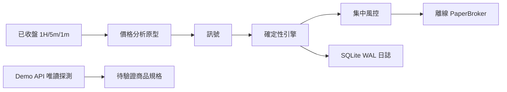

# Gold Spot 自主交易系統

目前版本：**0.1 離線執行核心＋Capital.com Demo 唯讀探測**。

已完成風控、離線券商、交易狀態管理、持久化日誌、價格分析原型及驗收計算。
AI 新聞分析、Capital.com 實際 Demo 送單與 Live 尚未啟用。完整需求與完成範圍請看
[實作報告](docs/implementation-report.md) 與 [規格](.scratch/autonomous-gold-cfd-trading/spec.md)。

另提供 [CSV 行情重播](docs/csv-replay.md)，可將 bid/ask OHLC 串接到多週期分析及交易引擎。

## 直接執行

在本目錄 PowerShell 執行：

```powershell
.\run.ps1 replay
.\run.ps1 test
```

`replay` 每次建立獨立的 `runtime/replay-時間/`，包含 `events.db`、`report.json`、`report.md`。
所有展示行情與商品規格皆為 **SYNTHETIC 合成測試資料**；不代表市場回測、帳戶收益或驗收通過。

## Demo 商品探測

先在 Python 3.12 虛擬環境安裝選用的 Windows Credential Manager 依賴：

```powershell
python -m venv .venv
.\.venv\Scripts\python.exe -m pip install -e '.[credentials]'
.\run.ps1 credentials-set
.\run.ps1 demo-discover
```

`credentials-set` 在你自己的終端隱藏輸入登入識別、API key、自訂 API password，
直接保存至 Windows Credential Manager。不要貼到聊天。
`demo-discover` 僅登入固定 Demo endpoint 並查詢 Gold 候選商品，保存至 `runtime/discovery.json`。
確認候選 epic 後可執行：

```powershell
.\.venv\Scripts\python.exe -m gold_system demo-discover --epic <已查得的epic> --output runtime/gold-details.json
```

不要把 discovery 檔中的帳戶或個資分享到公開儲存庫。程式目前只保存市場查詢回覆，並未擷取帳戶清單。

## 架構



交易引擎不依賴 GUI。啟動脚本使用專案 `.venv`，若尚未建立則使用此電腦現有的 bundled Python 3.12。
換機時請建立 `.venv`。此版本重啟後進入恢復鎖定，尚未提供解除 API；展示請開啟新的 run 目錄。
