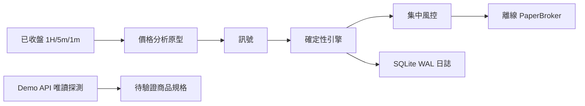

# Gold Spot 自主交易系統

目前版本：**0.1 離線執行核心＋Capital.com Demo 唯讀探測**。

已完成風控、離線券商、交易狀態管理、持久化日誌、價格分析原型及驗收計算。
AI 新聞分析、Capital.com 實際 Demo 送單與 Live 尚未啟用。完整需求與完成範圍請看
[實作報告](docs/implementation-report.md) 與 [規格](.scratch/autonomous-gold-cfd-trading/spec.md)。

另提供 [CSV 行情重播](docs/csv-replay.md)，可將 bid/ask OHLC 串接到多週期分析及交易引擎。

## 直接執行

在本目錄 PowerShell 執行：

```powershell
.\run.ps1 replay
.\run.ps1 test
```

完整測試需要 Demo 非同步傳輸依賴；新環境先執行：

```powershell
.\.venv\Scripts\python.exe -m pip install -e '.[demo]'
```

`replay` 每次建立獨立的 `runtime/replay-時間/`，包含 `events.db`、`report.json`、`report.md`。
所有展示行情與商品規格皆為 **SYNTHETIC 合成測試資料**；不代表市場回測、帳戶收益或驗收通過。

## Demo 商品探測

先在 Python 3.12 虛擬環境安裝選用的 Windows Credential Manager 依賴：

```powershell
python -m venv .venv
.\.venv\Scripts\python.exe -m pip install -e '.[credentials]'
.\run.ps1 credentials-set
.\run.ps1 demo-discover
```

`credentials-set` 在你自己的終端隱藏輸入登入識別、API key、自訂 API password，
直接保存至 Windows Credential Manager。不要貼到聊天。
`demo-discover` 僅登入固定 Demo endpoint 並查詢 Gold 候選商品，保存至 `runtime/discovery.json`。
確認候選 epic 後可執行：

```powershell
.\.venv\Scripts\python.exe -m gold_system demo-discover --epic <已查得的epic> --output runtime/gold-details.json
```

不要把 discovery 檔中的帳戶或個資分享到公開儲存庫。程式目前只保存市場查詢回覆，並未擷取帳戶清單。

## Demo 唯讀對帳與歷史資料

```powershell
.\run.ps1 demo-reconcile
.\.venv\Scripts\python.exe -m gold_system demo-reconcile --async-http
.\.venv\Scripts\python.exe -m gold_system demo-history --start 2026-09-04T00:00:00+00:00 --end 2026-09-04T21:00:00+00:00 --output runtime/history-new
```

`demo-reconcile` 讀取前後帳戶、交易模式、持倉、掛單及近期活動；不送單、不取消訂單、不改交易模式。
SQLite 摘要儲存於 `runtime/demo-audit.db`，帳號以雜湊代替，原始帳戶回應不落盤。
`SNAPSHOT_MATCHED` 僅表示本次讀取吻合，**不是交易解鎖**；`RECOVERY_LOCKED` 的原因會列在 `reasons`。
目前 CLI 使用空的本機預期持倉集合，所以任何既有持倉都必須另行核對，不會自動接管。
獨立對帳模組尚未接到遠端送單服務，不會改變離線 PaperBroker 的狀態。
`--async-http` 使用非同步連線池，仍然唯讀且不提供 write_guard；任何訂單寫入預設被拒絕。

`demo-history` 要求新的輸出目錄，保留原始分頁、SHA-256 與接收時間。
缺棒不插值；原始時間戳的開棒／收棒語意尚未實證，不能直接當成已驗收的回測輸入。

## 費用上限狀態

```powershell
.\run.ps1 cost-status
```

只查本地 USD 費用帳，不登入券商或呼叫 AI。`cap_usd: null` 表示尚未核准月上限，
不是無限預算；此時 `analysis_available` 為 false。
本地 `spent_usd` 僅代表已登錄費用，不是 ChatGPT/Codex 帳戶用量或服務商帳單總額。

費用流程為「預留最大費用 → 呼叫服務 → 依實際費用入帳」。未知結果保留額度並阻擋後續付費分析；
重複 request ID 不會再次呼叫服務。超出預留額會如實記錄並鎖定，不會截低成本數字。
AI、行情與主機三類費用共用同月上限，月份使用 UTC。
目前沒有付費 provider adapter 或預算設定 UI；月額需先完成用量量測並取得使用者核准。

`async_capital.py` 已提供固定 Demo 網址的非同步傳輸與預設關閉的初始下單方法，
初始成交對帳已與 journal 接線並以假成交回覆測試；唯讀快照另有真實 Demo 驗證。
沒有 CLI 可解鎖或送單；正式獨立風控 guard、其餘訂單動作與恢復服務仍待接線。
不要以測試中的允許回傳值替代正式驗收或實際帳戶安全檢查。

## 盤中權益路徑壓力測試

```powershell
.\.venv\Scripts\python.exe -m gold_system stress-replay --report examples/stress-synthetic.json --output runtime/stress-example.json --block-size 1 --simulations 1000 --seed 7
```

以上是明確合成的功能範例，不是行情或策略績效。輸出檔必須尚未存在。
真正研究時改用新版 `replay-csv` 產生的 `report.json`，其 `trade_paths` 包含每筆完整交易的盤中权益路徑。
舊報告或沒有完整交易的報告不能補造路徑；需重新重播／收集資料。

`--block-size` 為一起重抽的連續交易筆數，`--seed` 讓結果可重現。
`--extra-cost-fraction` 是每筆相對起始權益的額外壓力成本，預設 0，不重扣原始交易已含成本。
預設參數僅供研究起點，尚未校準；輸出永遠保持 `qualified: false`。

## Walk-forward 研究介面

`walk_forward.py` 提供時間順序的訓練／purge／測試窗協調器。
每個 fold 在測試前寫入 `prepared.json`，包含資料與設定雜湊；測試與帳務驗證成功後才寫 `result.json`。
資料尾端不夠一個完整測試窗時會明確列為未測。既有輸出目錄不會被覆寫。

目前訓練器及策略 evaluator 尚待接線，沒有把此工具包裝成已可執行的實際 OOS 策略驗收命令。
測試 callback 也不是安全沙箱；外部資料讀取、宏觀 vintage 和完整成本仍須另外驗證。

## 架構



交易引擎不依賴 GUI。啟動脚本使用專案 `.venv`，若尚未建立則使用此電腦現有的 bundled Python 3.12。
換機時請建立 `.venv`。此版本重啟後進入恢復鎖定，尚未提供解除 API；展示請開啟新的 run 目錄。

### 本機停止新倉

指定執行引擎／Gateway 實際使用的既有資料庫（不要建立另一份空資料庫）：

```powershell
.\.venv\Scripts\python.exe -m gold_system stop-new --database runtime/demo-audit.db
```

此命令將停止狀態與稽核事件一起落盤。Paper 引擎每次新倉／加倉前、
Demo 獨立風控每次驗證時都讀取此狀態；既有停損與時間退出仍會執行。
它不是「全部平倉」或「取消掛單」，也不能撤回已通過檢查或已送到券商的請求。
目前未提供解除此鎖的命令；不要以刪除資料庫方式恢復交易。

### 固定價格策略的 walk-forward 重播

```powershell
.\.venv\Scripts\python.exe -m gold_system walk-forward-csv --csv YOUR_BID_ASK.csv --contract YOUR_VERIFIED_CONTRACT.json --output runtime/walk-new --train-size 1800 --test-size 300 --initial-equity 10000
```

輸入格式與 `replay-csv` 相同，輸出目錄必須不存在。此處長度與資金只是使用範例，
不是校準結果。前段資料只暖機固定價格策略；不訓練 AI、不搜尋最佳參數。
每個测试窗使用共用交易引擎與風控，並承接前窗資金；保留逐窗稽核 DB、
重播報告、凍結設定及全段彙總。所有結果仍標記不具 Demo／Live 驗收資格。

### 原始歷史資料完整性檢查（離線）

```powershell
.\.venv\Scripts\python.exe -m gold_system history-audit --directory runtime/history-20260904
```

從原始分頁重建合併資料，核對 SHA-256、頁面區間、筆數與缺口記錄。
`INTERNALLY_CONSISTENT` 僅表示檔案互相一致，不是券商簽章、收棒時間或資料品質認證。
時間語義限制見 [研究筆記](docs/research/capital-history-semantics.md)。

### Codex 分析來源

已提供本機 Codex CLI 接入與非同步 Paper 服務協調層，並完成一次實際 ChatGPT 登入
呼叫的 `NO_TRADE` 測試。功能、架構、測試指令與尚未接線項目見
[Codex 分析代理接入](docs/codex-analysis-setup.md)。連線測試會使用 Codex 額度。
