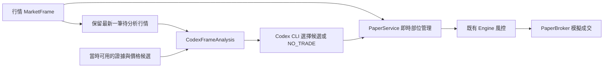

# Codex 分析代理接入

2026-09-19：依使用者選擇，以本機 Codex CLI／ChatGPT 登入作為分析來源。
Capital.com API 繼續負責行情與券商介面；不需要將 Capital.com API key 提供給模型。

## 已實際確認

- 本機 `codex-cli 0.153.4` 可用，一般使用者環境 `codex login status` 顯示 ChatGPT 登入。
- `python -m gold_system codex-check` 已完成一次真實 Codex 連線測試。
- 傳送內容僅為合成的空候選／缺乏證據，回傳 `NO_TRADE / INSUFFICIENT_EVIDENCE`。
- CLI 回報 input_tokens=11065、cached_input_tokens=0、output_tokens=35。
- 這不是黃金交易分析績效，也未下單。此次未指定模型 ID，尚未完成模型版本凍結。

官方 [非互動模式文件](https://learn.chatgpt.com/docs/non-interactive-mode) 說明
`codex exec`、`--json`、`--output-schema` 與既有 CLI 認證重用。
部署選項以本機 `codex exec --help` 及 [官方設定範例](https://learn.chatgpt.com/docs/config-file/config-sample) 核對。
此接入限使用者本機受信任執行，不應把帳號認證檔案放進 GitHub 或公開 CI。

## 執行關係



`service.py` 的交易管理與分析為獨立 asyncio 工作。只有一個分析請求同時執行，
忙碌時更新待分析行情，避免累積過期工作。分析錯誤、到期、重複行情或資料故障
會清除可入場訊號；已存在的 Paper 部位仍處理停損／時間退出。
服務關閉會取消並回收分析工作，日誌明確記錄是否仍有部位，不把關閉宣稱為平倉。

`codex_analysis.py` 使用 stdin 傳入資料、JSON Schema 約束選擇，模型只可回傳候選 ID。
模型無法透過回傳值改掉候選的結構停損／目標。候選若過期或操作者已停止新倉，
回應即使成功仍不能入場。信心值目前未校準，不用於加大部位。

CLI 在獨立暫存工作目錄運作，設定唯讀 sandbox、略過使用者 config、關閉 shell、apps、
瀏覽器、MCP 插件來源及多代理等功能；不傳入 broker/API key 環境變數。
這些限制不等於完成 OS 帳號／憑證庫隔離的威脅模型驗收。
逾時或取消時終止並回收子程序；失敗不自動重試，也不輸出原始 stderr。

## 使用與限制

再次執行連線測試會消耗 Codex 額度：

```powershell
.\.venv\Scripts\python.exe -m gold_system codex-check
```

可用 `--model` 明確指定可用模型。正式驗證前須凍結實際模型、CLI、prompt 版本並量測延遲。
目前測試的 model_pinned=false；不可把 CLI 預設模型當作已凍結策略。

程式接線使用 `CodexFrameAnalysis(runner, candidates, evidence, store, max_calls=..., clock=...)`，
再交給 `PaperService(engine, bridge, analysis_timeout=46)`；此例對應 runner 的 45 秒總時限。
模型等待不屬於每次行情的即時風控路徑。服務仍需要真正的行情 iterator、證據來源及候選生成器。
max_calls 必須明確指定，且失敗也算一次。它只限制單次服務生命週期；
全域剩餘額度、跨重啟配额、月費分攤、新聞／資料費用仍待接線，不能當作無限制免費運作。

token 使用量如實記錄，`actual_usd=null` 代表未知，不表示零美元。
此 Paper 接線不授予 Demo／Live 權限，真正券商部分平倉與完整服務部署仍在待辦清單。
